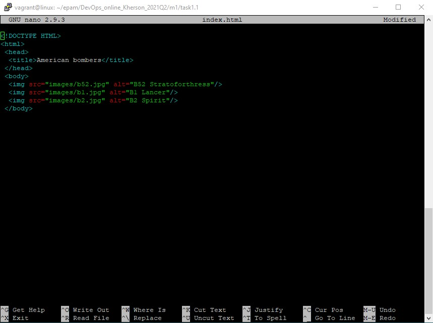
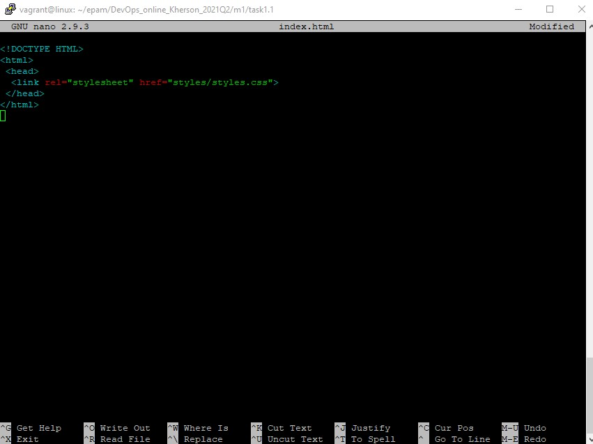
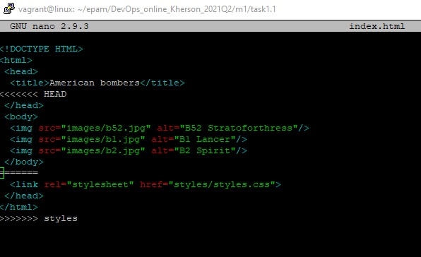
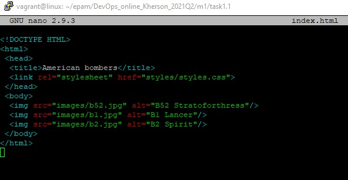
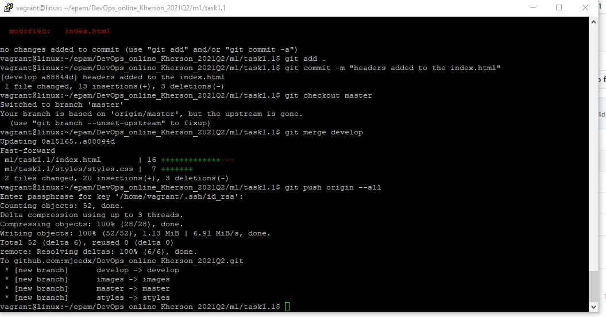

First of all we need to upgrade system and install Git:
```
sudo apt update && sudo apt upgrade && sudo apt -y install git
```
Configuring global settings:
```
git config user email mjee245@gmail.com && git config user name mJeedx
```
Next we need to create a GitHub account. I will use my early created account.

After we create a new repository with name DevOps_online_Kherson_2021Q2

Clone the repository to the project root directory:
```
git clone git@github.com:mjeedx/DevOps_online_Kherson_2021Q2.git
```
Create folder for all next manipulations:
```
mkdir -p DevOps_online_Kherson_2021Q2/m1/task1.1/
cd DevOps_online_Kherson_2021Q2/m1/task1.1
```
Make empty readme file:
```
touch readme.txt
```
Add file to the index and commit:
```
git add .
git commit -m "init commit"
```
Create develop branch, chechout on it:
```
git branch develop
git checkout develop
```
Create empty index.html file. Commit:
```
touch index.html
git add .
git commit -m "index.html was created"
```
Create branch "images", checkouton it. Create folder and put few images into it. Commit:
```
git checkout -b images
mkdir images && cd images
wget https://upload.wikimedia.org/wikipedia/commons/6/6e/B-52_over_Afghanistan.JPG
wget https://upload.wikimedia.org/wikipedia/commons/4/4a/B-1B_over_the_pacific_ocean.jpg
wget https://upload.wikimedia.org/wikipedia/commons/4/47/B-2_Spirit_original.jpg
git add .
git commit -m "branch and folder with images were created"
```
Edit index.html, add page sceleton and images. Commit:

```
git add .
git commit -m "image links were added to the index.html"
```

Go back to the "develop" branch. Create "styles" branch and folder with same name. Add styles.css, commit:
```
git checkout develop
git checkout -b styles
mkdir styles 
touch styles/styles.css
git add .
git commit -m "styles were created"
```

Add link to styles into index.html file, commit. Go back develop branch:

```
git add . 
git commit -m "styles added to the index.html"
git checkout develop
```
Merge "images" and "styles" branches with "develop":
```
git merge images
git merge styles
```
Wow, we got a merge conflict in index.html. The conflict was resolved, commit, merge again: 

* Before conflict:


* Resolved conflict:


```
git add .
git commit -m "resolving merge conflict"
```
Switch to master, merge develop:
```
git checkout master
git merge develop
```
Next, we have to add some styles to make the page more orderly. Commit, merge with master, push to the GitHub:
```
git push origin --all
```

Finnaly Then we are saving reflog into a file. Committing and pushing to the GitHub:
```
git reflog >> task1.1_GIT.txt
```

P.S. What is DevOps? In my mind DevOps is a way of designing of infrastructure and cooperation.
Teams of developers, testing and operations work together to get the synergy effect. 
So we have to get stable and predictable system with less count of failures and crashes.
As a result it provides to release code more often however to consume less resources 