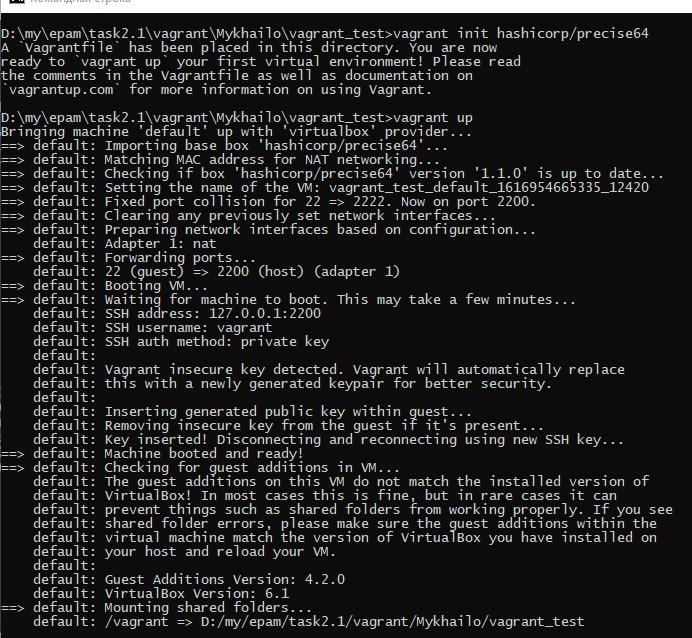
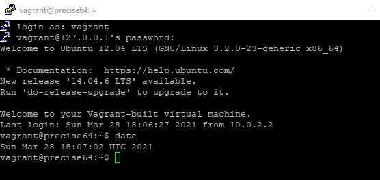
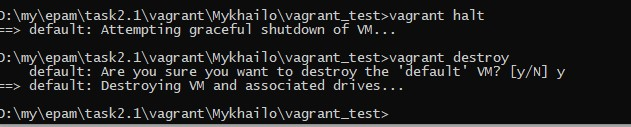

PART 1. HYPERVISORS

There are three most popular hypervisors used in production: Microsoft Hyper-V, VMware ESXI, KVM.

All of hypervisors divides in two types: 1st and 2nd type. 
First type Hypervisors installed directly on the clean server hardware like os, minimizing overhead. Examples are MS Hyper-V, VMware ESXI, KVM.
Second type hypervisor installed over the operating system, like common application. Hardware access is taken through host operating system, what increases overhead in resource consumption. For example: Oracle VirtualBox, VMware Vorkstation.

Part 2. WORK WITH VIRTUALBOX

First of all I had to download and install VirtualBox. 
Secondly I installed Ubuntu Desktop (Ub1_Zarichnyi). 
RCtrl + Q opens menu, where you can: 
	- save current state of the virtual machine and restore it later, 
	- shutdown machine smootly,
	- shutdown machine with/without restoring latest snapshot
After I created clone of the virtual machine(Clone_Ub1_Zarichnyi):
Then I put machines into different groups. Groups allows us to control multiple machines at the same time.


One more feature is snapshots. It's like a Git for virtual machines. Snapshots give us possibility to freeze and save the state of the VM and return to any of them.


Export and import VMs helps us to migrate VMs from one host to another. 
You can export VM into .ova file, copy file to another machine and import it.

There are many options you can find in menu Machine->Settings (Ctrl+S). 
This is the point, whee you can edit all settings of the VM.

In submenu "USB" yuo can redirect USB device which connected to the host machine directly into VM

Same you can do with any folder in the pc:


There are many variants of network connections. Official documentation provides us a great table, which describes all possible ways of interconnection. All of them are useful in different situations.


Internal mode allows to send data only between VMs in both sides. Additively you can make few different non-crossing networks:


Host-only network mode gives avalability to send data betweeen VMs + Host machine:


Bridged network mode connect VM to a main interface connected with router. So VM can send and receive traffic from whole network including internet:


VBoxManage is the CLI for virtualBox, allows managing virtual machines. 

```VBoxManage showvminfo <VM_vmname>``` gives you all of the information about VM

```VBoxManage createvm --name <VM_name> --register``` creates new VM

```VBoxManage startvm <VM_name>``` starts VM

```VBoxManage clonevm <VM_name> --name=<new_VM_name> --register --mode=all``` clones VM


Part 3. VAGRANT

Vagrant - software which gives you possibility quickly create virtual machines for testing. Vagrant like a Docker for 1-st type virtualization.
To start using Vagrant you need to download it from the official website and install it.

Next, create folder for Vagrant, init Vagrant box start Vagrant box:

```
mkdir vagrant_test
vagrant init hashicorp/precise64
vagrant up

```



Connect to the VM using putty on "localhost:2200" and show current date and time



Stop and delete the created VM:

```
vagrant halt
vagrant destroy
```




//TODO make test env by vagrant 


P.S. Я всегда ищу для себя более эффективные способы усвоения материала и оставляю себе подсказки к новоизученому материалу так, чтоб они были всегда легкодоступными. И тут я заметил, что уже 4-й раз возвращаюсь подсмотреть некоторые подсказки в свой конспект к прошлому уроку(1.1). Таким образом я сделал для себя вики, которая всегда под рукой. Спасибо авторам курса за то, что я вынужден писать эти отчеты. Теперь я буду более терпимым к этому "тупому логгированию и так очевидных вещей".
Хотя если так разобраться - здесь ничего нового. Это просто конспект, как в тетради, только с картинками и на гитхабе. Как бы там не было дальше - для меня этот курс уже прошел не зря.