task2.2 

To register in educational purposes I have registered on AWS Free Tier:

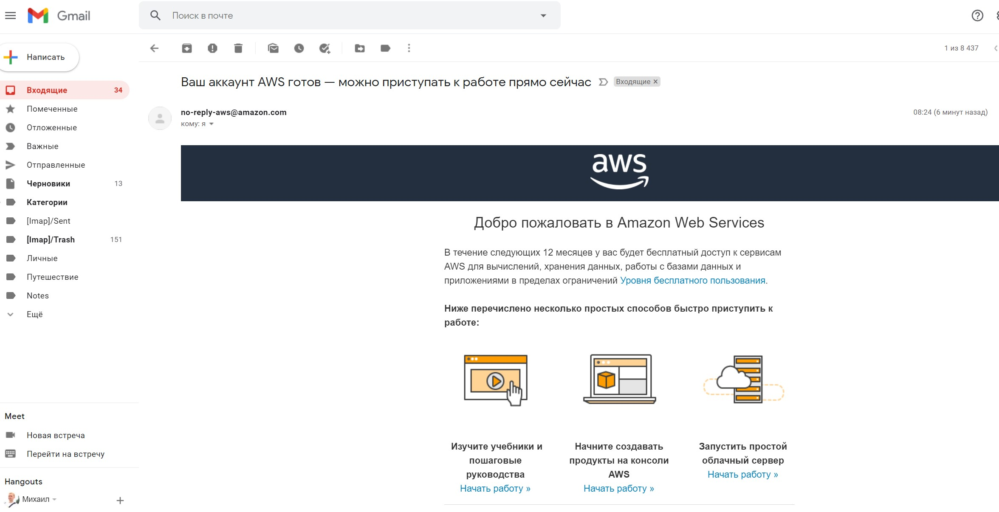

First, I have made a Lightsail VM:

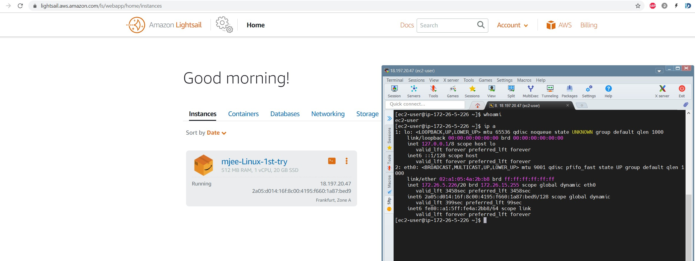

Next, I have made EC2 instance:

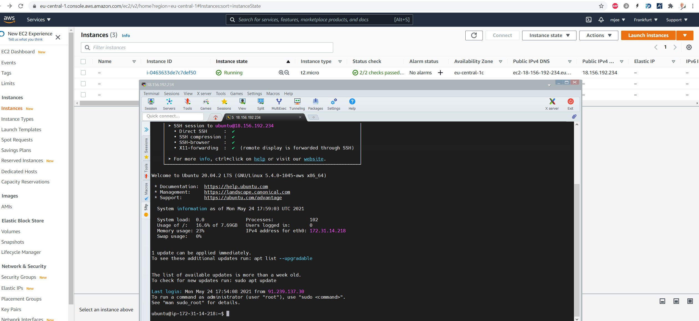

Creating a snapshot of the instanse to keep as a backup:

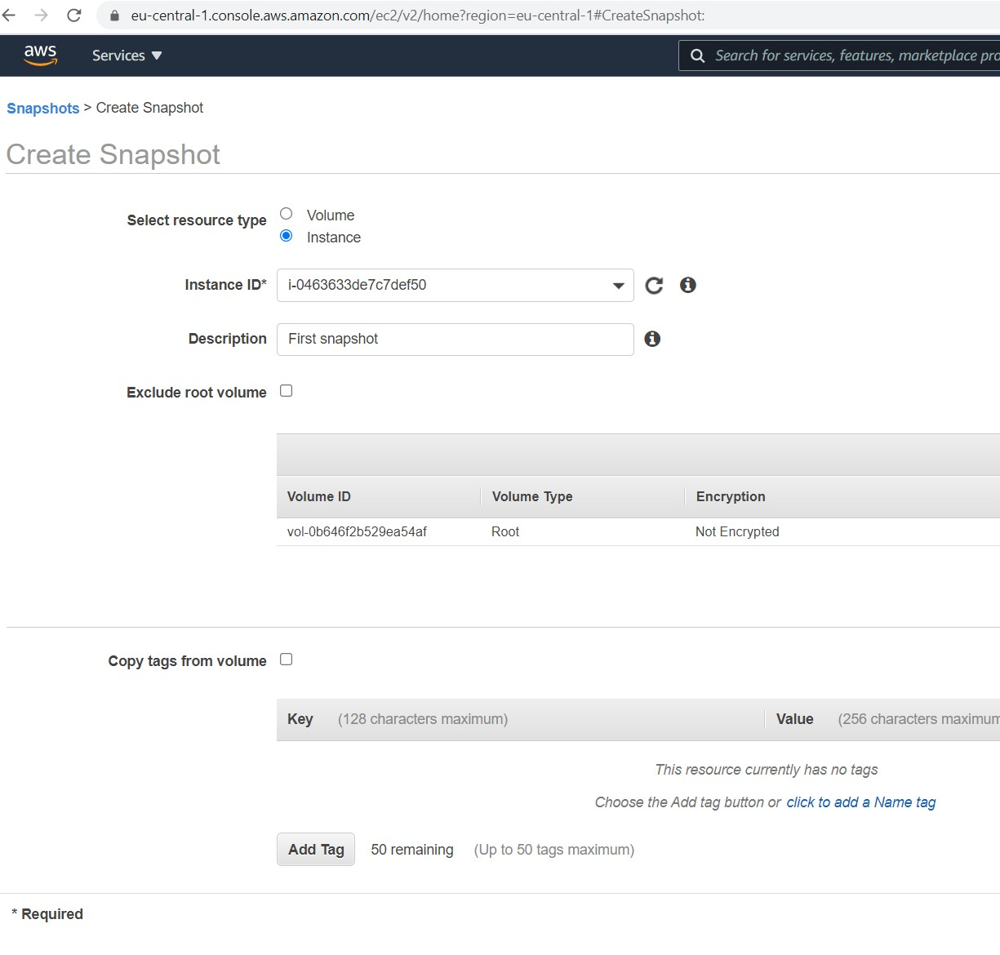
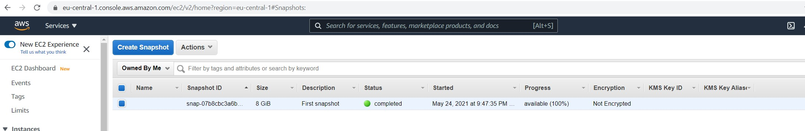

Later I created and attached disk D to second instance and created a new file:

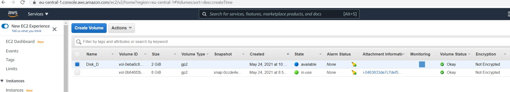
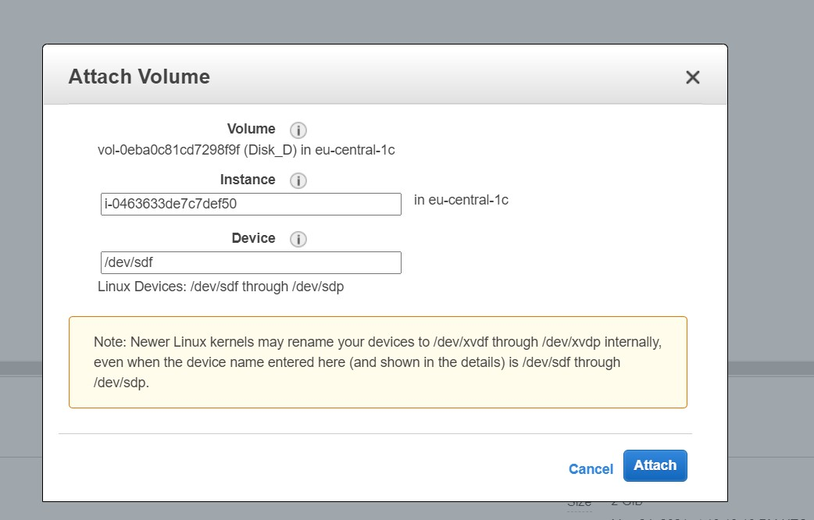
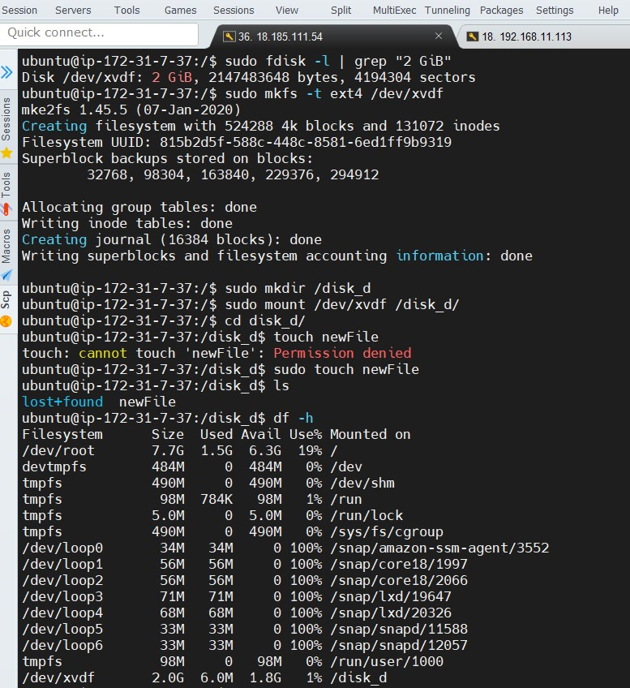

After I have created instance from backup:

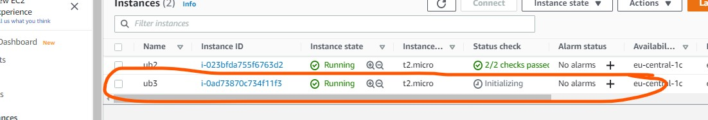

Detach disk D from 2nd instance and attach it to 3rd. You can see a file, that was created in second instance.

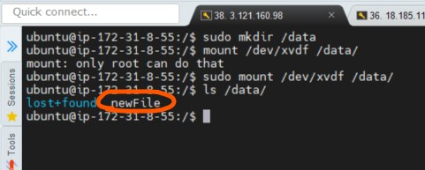

Next I've created WordPress instance with Amazon Lightsail:

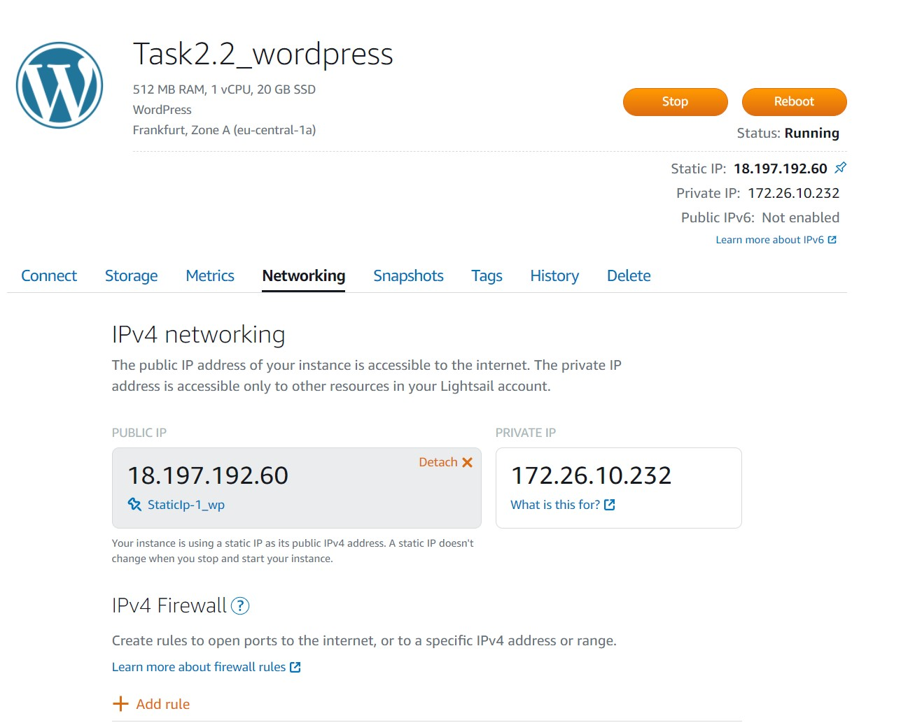
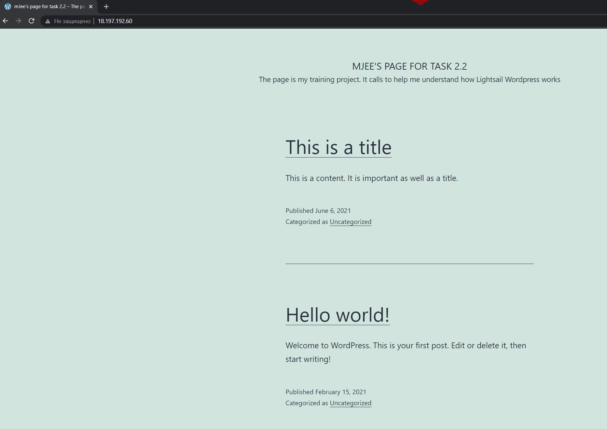

On the next step I have created S3 bucket and add some files into it:

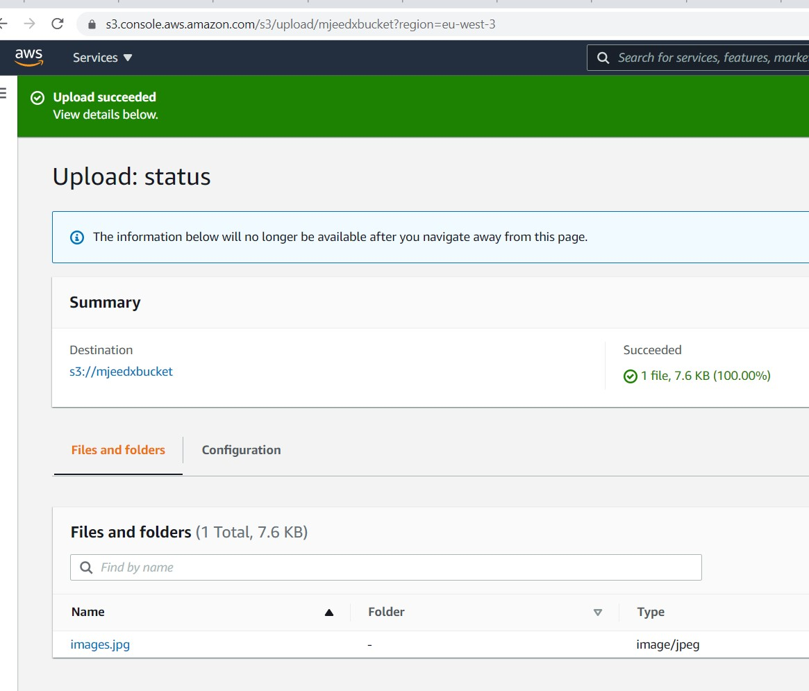
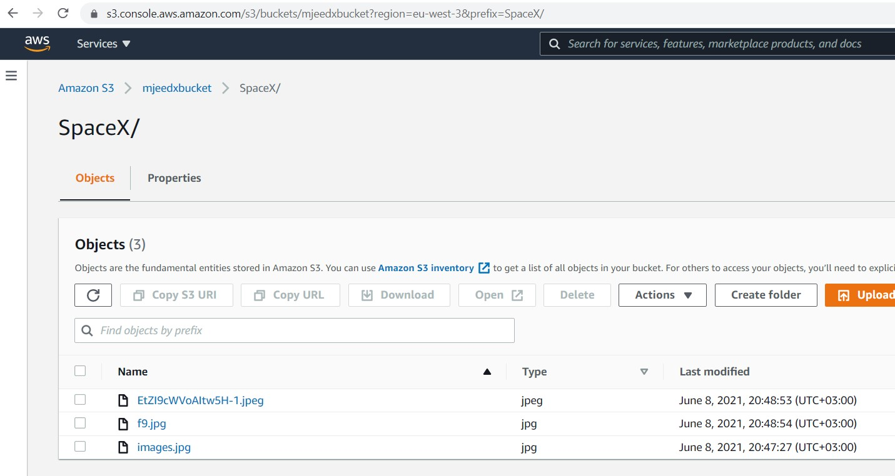

Also we can upload several files in one time:

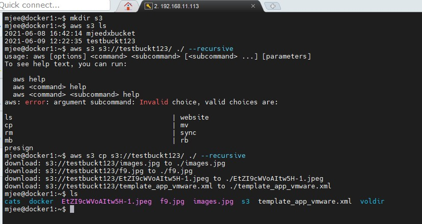

Below is a link to the website with my report:

[link](https://s3.eu-central-1.amazonaws.com/zarichnyi-dos2021.com/index.html)