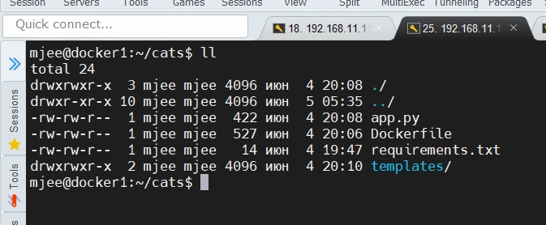
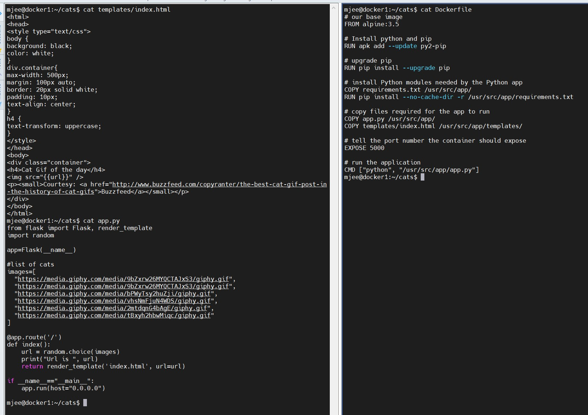
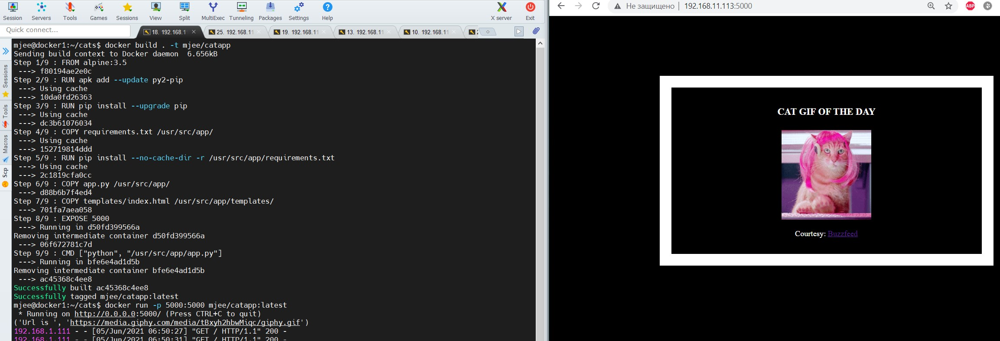
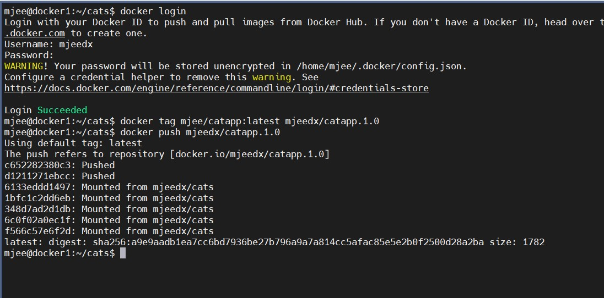
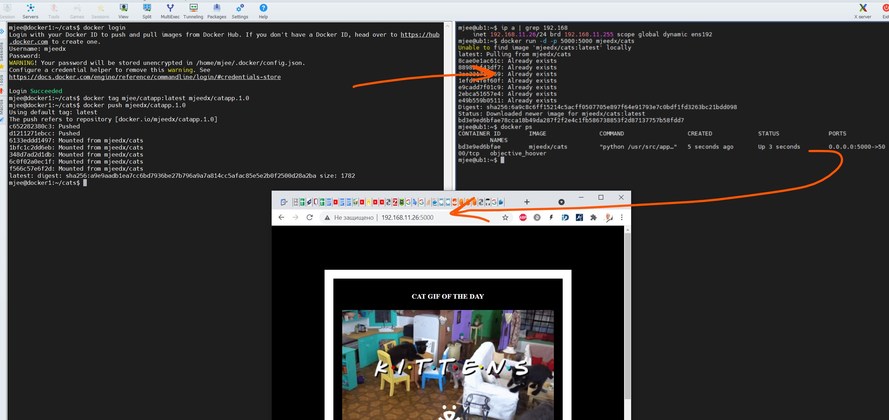

task11.1 Docker

First of all we have to create files structure for the Flask project:

After, fill up the files with the content:

Next, build and run docker container:

After login to the DockerHub and adding some tags into the image, publish it on the DockerHub:

Finnaly, run container on another server. Docker will pull in from DockerHub and run it. 

