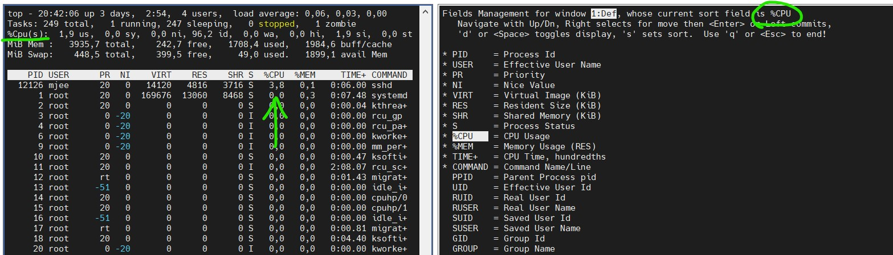

Task5.3 Part1

1. There are 5 different states process in Linux has:
R - Running/runnable
S - Interruptable_sleep
D - Uninterruptable_sleep
T - Stopped
Z - zombie
To watch them you can use utilities like `top`.

2. `pstree` utility shows us a tree of process, so you could see  children and parents processes.

3. ProcFS is a special FS, used for representing process structure like the familiar for us file tree, where root contains folders with PID names. So all can get direct access to the memory. Volume with Procfs mounted in /procfs. Every process has a folder with the name equal it's PID. 

4. To watch info about CPU, just print /proc/cpuinfo file.

5. `ps -au` gives you info about launched process. There you can see user owner, PID, % CPU and Memory consumption, args, used during process launch. 

6. There are two different types of process: kernel and user processes. Kernel mode is privileged mode for running of processes. It used by OS and most of the drivers. Process in user mode uses an area in virtual memory given him by OS. So one process can't reach memory belongs to another process. In contrast, kernel processes can share memory of each other, so it requires a lot of responsibility.

7. As we can see, top process has PID 24849 and 24817 and are in running state, processes PID 14492-23443 are in sleep mode, except 18876 - he is a zombie. PID 24224-24848 - are in idle kernel mode.

8. To watch processes belong to specific user, run `ps -au $USER`.

9. There are many brothers and sisters of the "ps" utility - htop, atop, glances.

10. `top` shows current information about processes running in a system, same as "ps" but in real time.

11. To watch processes of the user just run `top -u $USER`

12. You can use much interactive commands, for example:
arrows up,down,right,left - navigation on a screen
f, F key - opens menu where you can select current fields in "top" window,
n - helps you to set count of process in a screen
z - changing color mapping

13. To sort content by one column - press "f" button, after choose you column and push "s" button. 

14. Prioritization in Linux works same way as in others OSs. As more rate of "niceness" as lower priority of the process. 
`nice -n -20 command` - command runs command with highest priority (20 - lowest priority).

15. To change niceness by using "top" - run top and push "r" button. after enter nice ratio.

16. `kill` command user for terminating processes. To kill process run `kill PID_of_the_process`. Also you can use signals, most used for stopping are SIGTERM and SIGKILL. Example:
`kill -s SIGTERM 28234` - used to kill task with PID 28234.

17. `jobs` used to show list of the jobs. `bg`, `fg` - used for putting job into background mode and take it back. `nohup` - immunes jobs from hangup signal.

Task5.3 Part2 

1.  `ssh user@hostname`, - To quick connect from windows machine run 
`ssh-keygen`, - generating ssh key pair
`ssh user@hostname -p port` - ssh connection through specific port

2. Four basic step to increase the security of the ssh server are: using SSH keys, do disable password authentication,  change ssh tcp port, disable root account.

3. #procrastinated 23.04.2021

4. Below I made port forwarding of tcp/22 on the host machine to the tcp/2222 on the guest machine:

