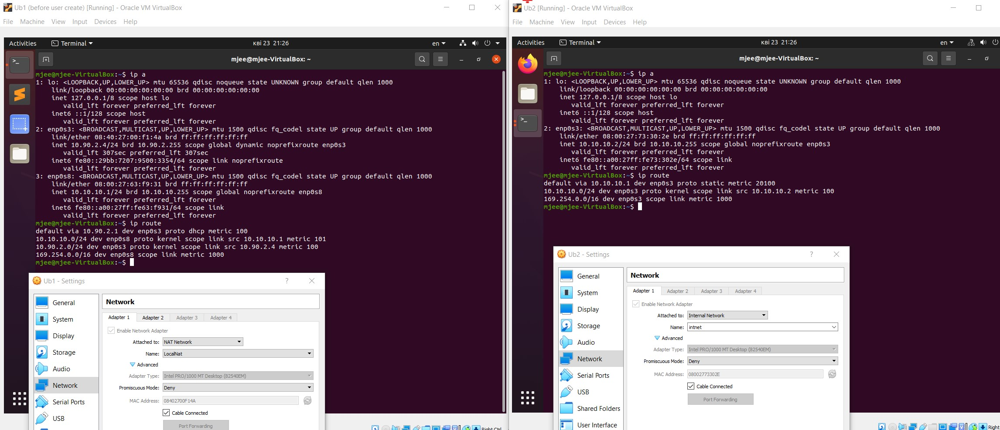
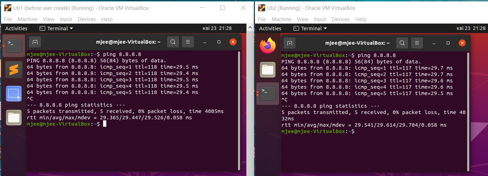
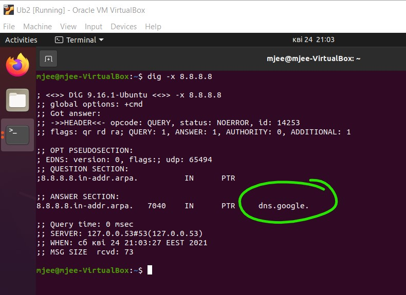
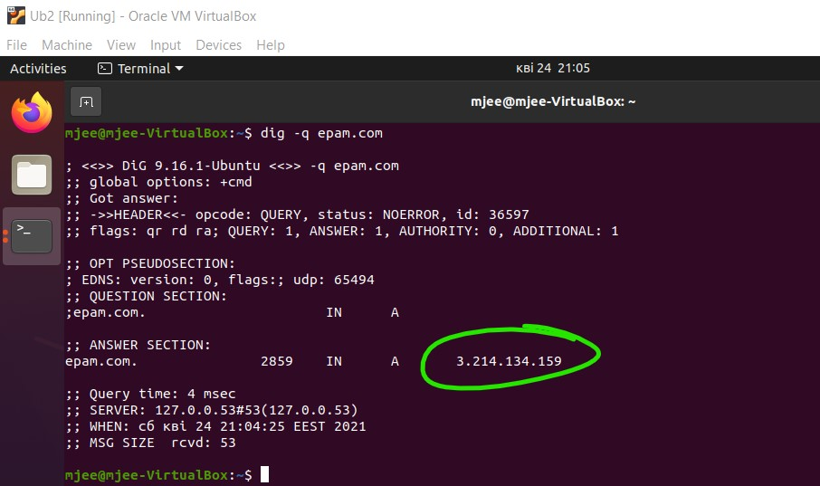
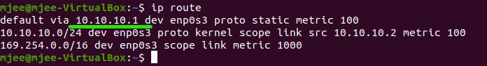
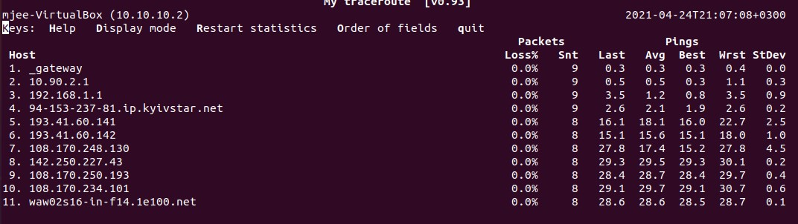

task 6.1 

1. Create cheme according to task.

2. VM2 has one interface (internal), VM1 has 2 interfaces (NAT and internal). VM2 has an access to the Internet through VM1:

`sudo iptables -t nat -A POSTROUTING -o enp0s3 -j MASQUERADE`

to enable traffic forwarding among interfaces, uncomment "net.ipv4.ip_forward = 1" string in /etc/sysctl.conf file:

4. We can `ping 8.8.8.8` from VM1 and VM2:

5. To determine, which resource has an IP address 8.8.8.8, use: 
`dig -x 8.8.8.8`

6. Determine, which IP address belongs to resource epam.com, use: 
`dig -q epam.com`

7. To watch def gateway and routing table, use:
`ip route` 

8. To trace route to site, use: `mtr google.com`:

