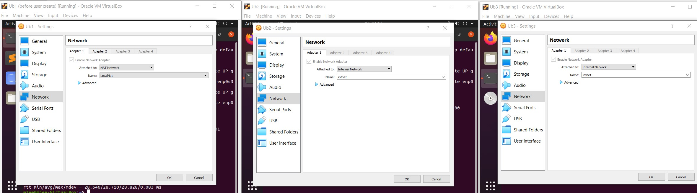
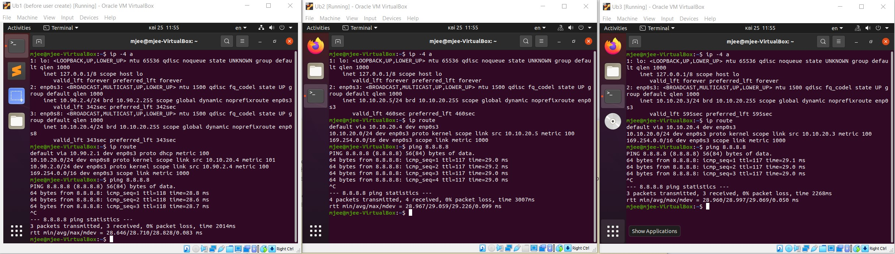
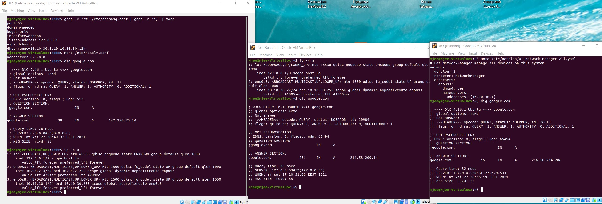

task6.2

1. I added one more VM3. VM1 has NAT and internal, VM2, VM3 – internal only interfaces. 

2. To configure dhcp server via vboxmanage, type a command: 
`VBoxManage.exe dhcpserver add --network intnet --ip 10.10.20.2 --netmask 255.255.255.0 --lowerip 10.10.20.3 --upperip 10.10.20.50 --enable`
next you have to add a default route:
`sudo ip route add 0.0.0.0/0 via 10.10.20.4`

Also you can use DHCP DNSMASQ server. We'll configure it on step 4. 

3. Checking IP addresses and internet access:

4. As DNS forward server we can use DNSMASQ (also as DHCP server). 

5. After all configurations, VM2 and VM3 can resolve DNS requests using DNS server, located on VM1:

