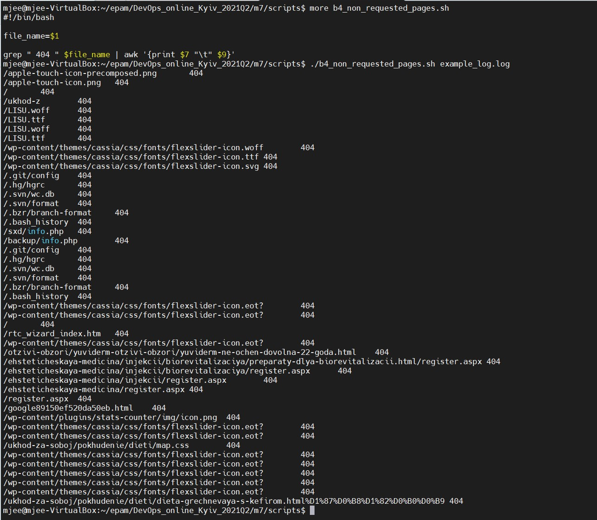

task7.1
####Part A ####
1. When starting without parameters, it will display a list of possible keys and their description.
  - The --all key displays the IP addresses and symbolic names of all hosts in the current subnet
  - The --target key displays a list of open system TCP ports.

####Part B####

1. To watch from which IP were most requests run next code:

`more apache_logs.txt | grep -E -o "([0-9]{1,3}[\.]){3}[0-9]{1,3}" | sort | uniq -c | sort -gr | head -n 1`

2. To watch most requested page run:

`more apache_logs.txt | awk '{print $7}' | sort | uniq -c | sort -gr | head -n 1`

3. To watch how many requests were there from each ip:

`more apache_logs.txt | grep -E -o "([0-9]{1,3}[\.]){3}[0-9]{1,3}" | sort | uniq -c | sort -gr`

4. We can conclude that when user opens non-existent page, he takes code 302 and get redirrect to 404 page.

`grep 302 apache_logs.txt | awk '{print $7 "\t" $9}'`

5. To watch when did site get the most requests, execute:

`more apache_logs.txt | awk '{print $4}' | sort | uniq -c | sort -gr | head -n 1`

6. To watch unique user agents and IP addresses run code:

`grep bot apache_logs.txt  | awk -F\" '{print $6}' | sort | uniq -c`

