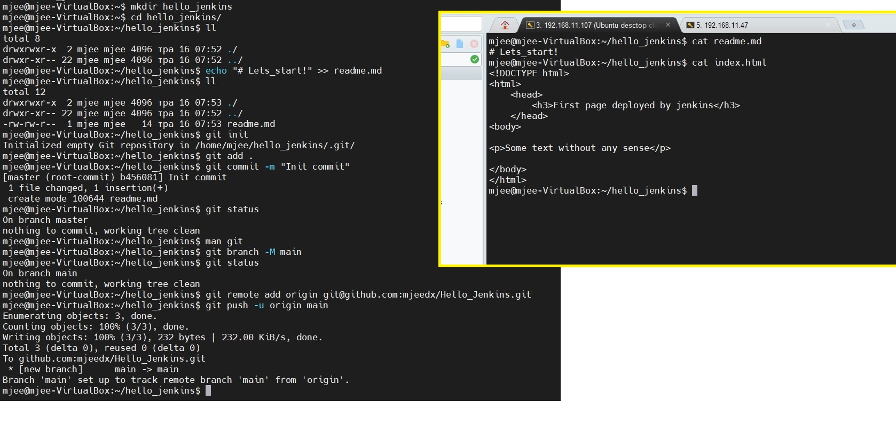
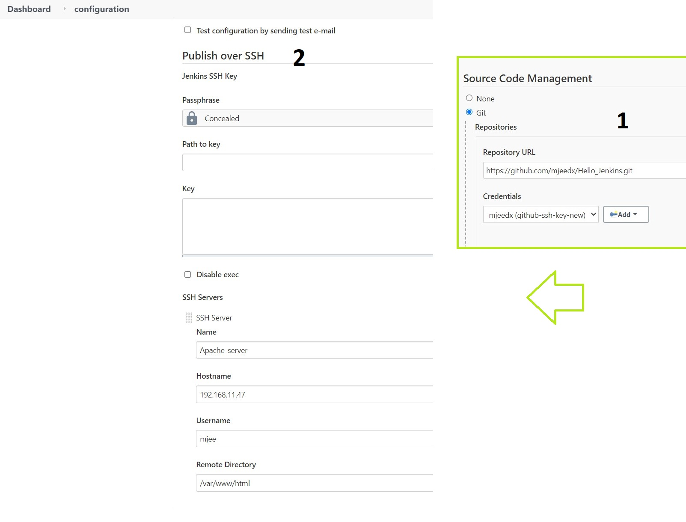

task8.1

First we have to install Jenkins. I'll not show you all steps how to do it cuz process is pretty easy to make.
So Jenkins, locales, plugins installed.
We're creating SSH keys, and copy them into github and machine with Apache server:

After connect to the Apache server and set rights for /var/www directory:

Create Git repo with simple html and readme files, push it into the Github:

After make pipeline, create credantials, settings for Publish over SSH plugin:

...and build the project. If all things work you'll see index.html page on the apache machine

Add some new content into index.html, push in on the Github and run Jenkins project. You'll see your changes:

After configure Github Webhooks and test it by making changes in the index.html:

