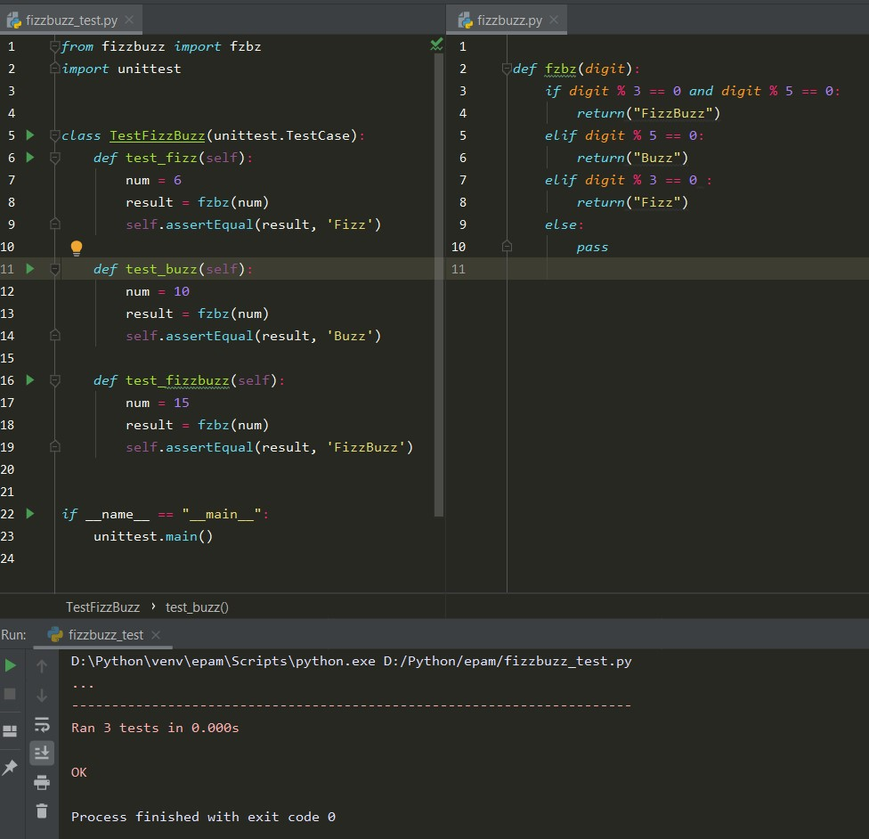
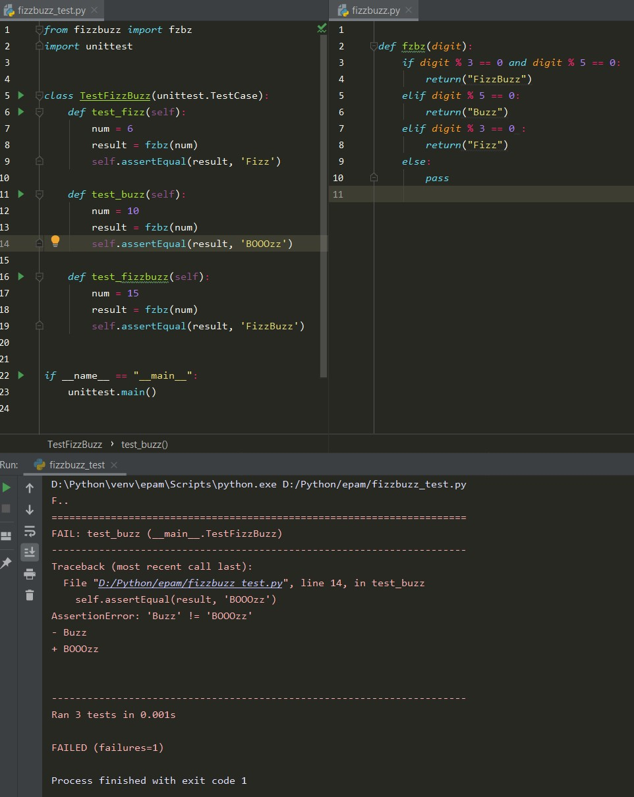
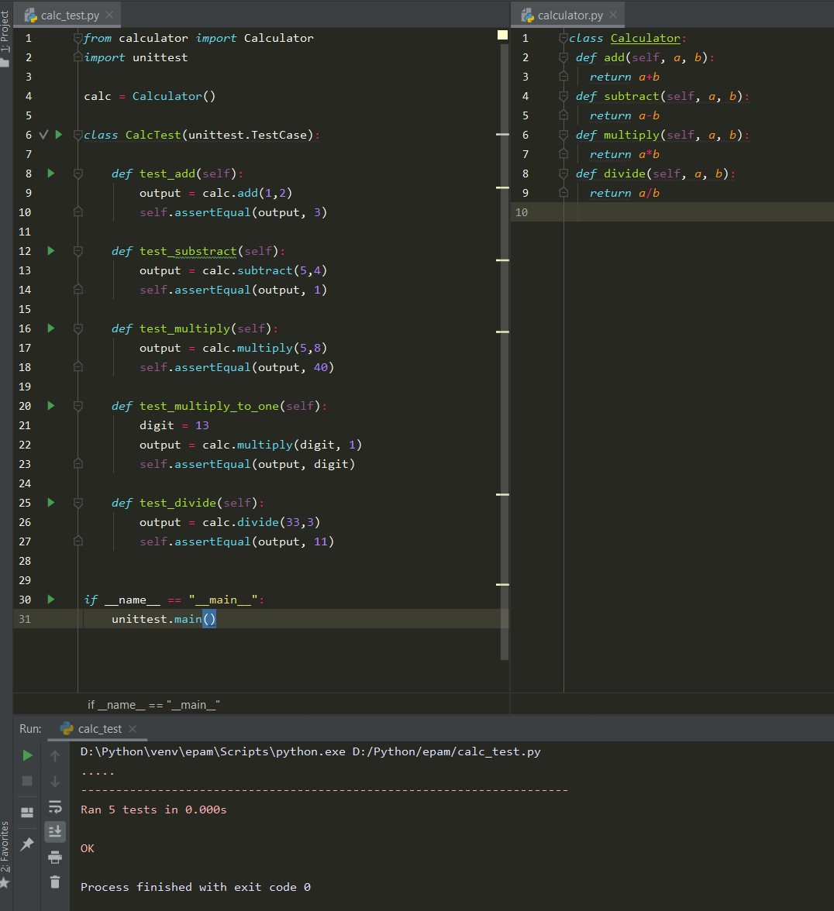
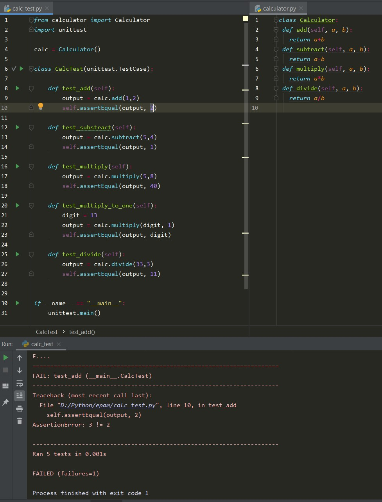

task9.1

A unit test checks components in your application for valid behavior. When you're writing unit tests you give to your test-function results of wright execution. Function runs target modules and compare results with given him to you.

If all tests are passed you will take a message about successful testing:

If something goes wrong - test will fail, and you can see error message: 

You can see successful and failed unit tests of calculator app below:

